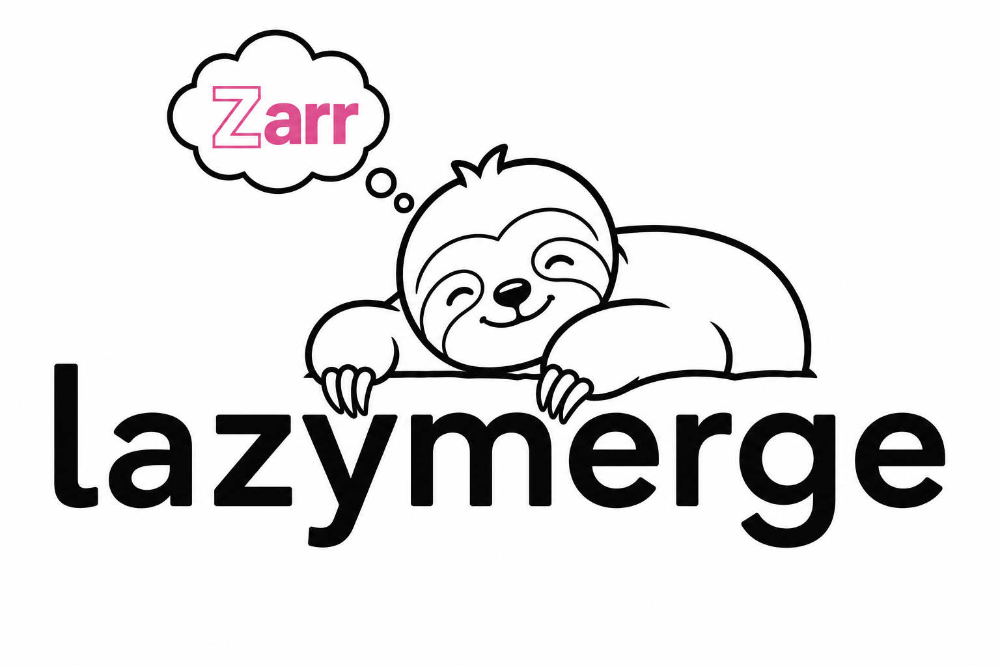

<p align="center">
  
</p>

# lazymerge

Lazily merge geospatial Zarr arrays using [Cubed](https://cubed-dev.github.io/cubed/).

## Why

Inspired by the excellent [lazycogs](https://developmentseed.org/lazycogs/).

lazycogs provides amazing out of the box support for generating lazy datacubes
for large collections of COGs using a stac-geoparquet index.  Lazymerge is an experimental library to generalize this concept to arbitrary data sources building on
recently developed specifications and libraries..

 - [Geozarr](https://geozarr.org/) for defining CRS, transform and multiscale
   information for source Zarr arrays.
 - [VirtualiZarr](https://virtualizarr.readthedocs.io/en/stable/index.html) to
   represent legacy, archival files (COG, HDF5, GRIB) as virtual Zarr arrays.
 - [Zarr DataFusion Search](https://developmentseed.org/zarr-datafusion-search/)
   for storing and querying STAC like metadata directly in Zarr and Icechunk
   stores.
 - [Cubed](https://cubed-dev.github.io/cubed/index.html) for bounded memory,
   lazy multi-dimensional array processing.

Geospatial datasets are often composed of many individual source arrays
(satellite scenes, flight lines, model tiles) that overlap in space and often 
use different coordinate reference systems. Similar to **lazycogs**, **lazymerge** aims to create lazy "target" arrays with a defined extent and CRS that require no
initial data loading.  It uses Cubed's lazy, chunked
execution model so that only the source regions needed for a given output
chunk are read and reprojected on demand. This means you can define a
merge over terabytes of input data without reading a single byte until
an operation that requires `.compute()` is called, and then only the bytes required for the requested output are fetched.

**Why not just use lazycogs?** - Zarr is gaining traction across many data
providers (both ESA and NOAA are transitioning several large dataset
distributions to Zarr in the near future).  Additionally, VirtualiZarr allows us
to represent many legacy data formats as Zarr.  Standardizing on a single
specification for data I/O can drastically simplify building client
applications, reducing the complexity of different file drivers that we have
today.  Lazymerge is an attempt to demonstrate how the seamless, high performance
workflows that lazycogs provides can be achieved with Zarr. 

### Key features

- **Lazy evaluation** -- define a merge target (CRS, bbox, resolution) and
  get back a Cubed array. Nothing is read until you compute.
- **Cross-CRS reprojection** -- sources in different CRS are reprojected to
  the target grid per chunk, using affine transforms and pyproj.
- **Multiscale overview selection** -- when sources have overview pyramids,
  lazymerge automatically picks the coarsest level that avoids upsampling.
- **Multi-band support** -- request multiple bands and get a stacked
  `(band, y, x)` output array.
- **Temporal grouping** -- bucket source scenes by time period (day, week,
  month, year, or fixed N-day windows) to produce `(time, y, x)` outputs.
- **Lazy virtualization** -- optionally virtualize COGs on-the-fly during
  compute via a `virtualize` callback. Only sources that intersect the
  target grid are processed, and each source is virtualized exactly once.
- **DataFusion-powered source discovery** -- use SQL queries against metadata
  stored in Zarr (via `zarr-datafusion-search`) for spatial and attribute
  filtering of sources.
- **Dry-run explain plans** -- inspect which source regions would be read
  per output chunk without touching pixel data.

## Installation

```bash
uv add lazymerge
```

## Quick start

```python
import zarr
from lazymerge import merge, scan_store

root = zarr.open_group("my_data.zarr", mode="r")
index = scan_store(root)

result, spatial, proj, _ = merge(
    store=zarr.storage.LocalStore("my_data.zarr"),
    crs="EPSG:32618",
    bbox=(500000.0, 5999000.0, 502000.0, 6000000.0),
    resolution=10.0,
    source_index=index,
)

data = result.compute()
```

## Documentation

Full documentation is available at
[developmentseed.github.io/lazymerge](https://developmentseed.github.io/lazymerge/).

## License

See [LICENSE](LICENSE) for details.
